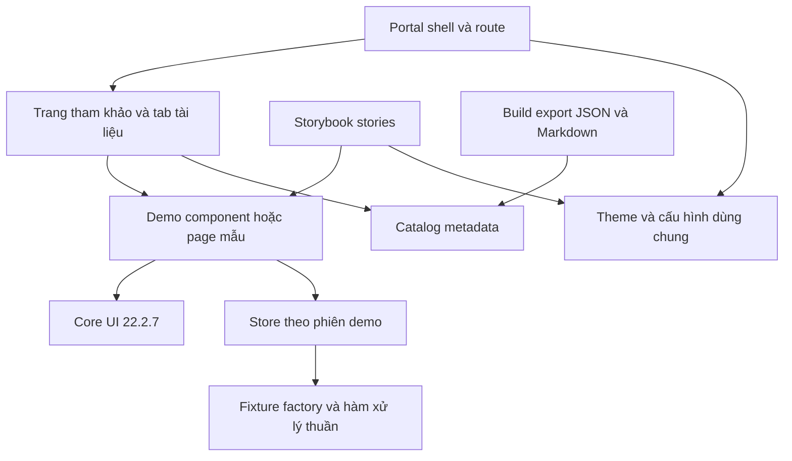

# Kiến trúc — Portal reference Core 22.2.7

## Mục đích và nguồn

Chốt ranh giới triển khai để portal, Storybook và catalog dùng chung ví dụ, dữ liệu và quy tắc giao diện mà không phụ thuộc vòng hoặc rò trạng thái giữa các mẫu. Phạm vi giữ nguyên đặc tả đã duyệt: 12 pattern, ba nhóm Storybook, layout Pages 1 và 12 acceptance criteria.

Parent đã xác minh: `.sdcorejs/specs/angular/2026-09-10-11-27-portal-reference-core22.md`, artifact `spec-portal-reference-core22-r1`, source revision `4f8d01818005dd7a5925dc6d46e7bfefb271242f`, hash `sha256:v1:0e2aa4f9c75d4684529518d14c71f23f03054757dcea67bb5d0a30d93f52fe1b`.

Gate bắt buộc vì nâng major dependency, xác định chủ sở hữu state dùng chung và tạo giao diện catalog cho consumer/AI. Tất cả code/artifact thuộc portal-template; không có thay đổi hay phụ thuộc source trực tiếp vào sales-platform local.

## Ranh giới và hướng phụ thuộc



- **Portal shell:** giữ `sd-layout`, cấu hình locale/number format/tab router và menu. Không chứa entity/form/query state của demo. Storybook không bootstrap `src/main.ts` hoặc đăng ký auth interceptor của portal.
- **Trang tham khảo:** sở hữu tab Preview/Hướng dẫn/Dữ liệu/Source, lựa chọn pattern và việc tải source. Pages luôn theo bố cục 1. Wrapper tài liệu không thay thế page header bên trong demo.
- **Demo:** component standalone có thể render trong portal hoặc Storybook; chỉ phụ thuộc Core, feature-local components và demo data. Không import `.storybook` hoặc application shell.
- **Theme/providers:** theme và cấu hình Core có cùng nguồn; mỗi host chỉ chọn provider thích hợp với lifecycle của mình. Không sao chép giá trị theme hoặc dùng selector CSS nội bộ từ Core cũ.
- **Catalog:** metadata thuần, không import Angular component/provider. Loader routes map riêng theo `patternId` để lazy load được. Build kiểm tra tập ID của metadata và loaders trùng khớp.

## Quyết định nền tảng

Giữ Angular standalone, lazy routes và npm hiện có; nâng theo dependency matrix Angular/Material/CDK 22 và Core pin `22.2.7`. Storybook 10.6 là ứng viên đã kiểm tra peer range; exact patch của toolchain chốt trong plan sau compatibility check. Không dùng ép peer dependency.

Core yêu cầu Node `^22.22.3 || ^24.15.0 || ^26.0.0`; shell hiện tại `22.14.0` không đủ. Chọn runtime phù hợp đã có hoặc runtime biệt lập của dự án trước install/build, ghi lệnh tái lập trong README. Không thay Node/PATH toàn máy. Nếu runtime không sẵn có, báo trở ngại trước khi khẳng định build/test.

Giữ provider và lifecycle hiện có khi hợp lệ; không suy diễn phải chuyển đồng thời toàn bộ sang zoneless hay một form/state framework khác. Nếu migration Core bắt buộc thay API, adapter nằm ở boundary phù hợp và phải được kiểm tra bằng source/package 22.2.7.

## State và lifecycle

| Dữ liệu/state | Chủ sở hữu | Vòng đời và ràng buộc |
| --- | --- | --- |
| Locale, number format, tab router | Portal configuration | Global settings hiện có; Storybook có cấu hình local tương đương |
| Pattern, tab tài liệu | Reference container | Chuyển tab giữ instance demo đã tạo; rời pattern hủy instance |
| Seed data, mutation, simulated latency/error | Demo session provider | Mỗi instance/story tạo store riêng từ fixture factory; reset khôi phục seed; không root singleton |
| Query/sort/page/selection | List container | Selection theo ID; sort giữ selection, page/filter reset; scope current page |
| Detail entity | Session store + selected ID | Giá trị derive từ store; không giữ bản entity mutable thứ hai |
| Create/update draft, errors, dirty/pending | Form hoặc drawer container | Một form owner; đọc snapshot lúc mở, submit qua store, giữ draft khi lỗi |
| Overlay và focus restore | Component mở overlay | Đóng/destroy hủy listener/subscription/timer; trả focus về opener còn tồn tại |

Demo store có các thao tác typed `query`, `get`, `create`, `update`, `reset` và trạng thái mô phỏng. Chỉ có operation bổ sung khi mẫu cụ thể cần; không dựng generic backend framework. Model/customer/order/category khác nhau vẫn là model typed riêng. Query/validation/mapping/tính tổng dùng hàm thuần khi đủ.

Trong một list-detail/create-update flow, route cha cung cấp session store để create/update và quay lại list thấy cùng dữ liệu. Các link độc lập có session mới từ seed; nếu ID không tồn tại thì hiện not-found có đường quay lại. Khi chuyển pattern/reset phải giải quyết dirty form trước khi hủy state. Không persist dữ liệu demo giữa phiên trình duyệt.

Để chuyển tab tài liệu không làm mất form, preview được tạo lần đầu khi cần rồi giữ mounted nhưng ẩn khỏi cây accessibility khi inactive; lifecycle không được tạo lại bởi mỗi lần chọn tab. Rời route phải giải phóng tài nguyên. Controls, service callbacks và story reset dùng cùng một source state, không có hai-way mirror riêng trong harness.

## Route và component map

| Thành phần | Vai trò | Bằng chứng / trạng thái |
| --- | --- | --- |
| `MainComponent` + `sd-layout` | Shell và tab router | Confirmed: `src/app/components/main/` |
| `ButtonDemoComponent` và các demo hiện có | Chuyển phần presentation cần dùng chung ra khỏi wrapper tài liệu khi cần | Confirmed source: `src/libs/components/button/`; cách tách là candidate |
| `PageReferenceComponent` | Tabs, metadata, preview outlet | Candidate: `src/libs/pages/reference/` |
| 12 pattern containers | Query/flow và composition theo từng pattern | Candidate: `src/libs/pages/patterns/` |
| Feature-local sections/line-item editor/drawers | Một trách nhiệm nghiệp vụ/UI độc lập, form owner rõ | Candidate; không tách component cho từng field |
| `DemoSessionStore` và fixture factories | State/data testable và isolated | Candidate: `src/libs/pages/data/` |
| Catalog model/data và route loader map | Contract thuần tách khỏi import runtime | Candidate: `src/libs/pages/catalog/` |
| Story decorators/harness | Providers, input controls, reset | Candidate: `.storybook/` và story colocation |

Catalog entry ở `/pages/<patternId>`; demo route độc lập `/pages/demo/<patternId>`. Demo flow dùng route children `detail/:id`, `create`, `update/:id` khi đúng với pattern. Drawer dùng cùng list container, không lồng một shell router bên trong drawer. Loader map có thứ tự tránh route `:patternId` nuốt `demo`.

Giữ route cũ hoặc redirect khi có mẫu thay thế tương đương; `patterns/page-builder` vẫn có route riêng. Không export route containers/feature-private children ra global barrels. Public exports chỉ gồm route entry cần host đăng ký và contract metadata cần exporter/test.

## Catalog v1 cho consumer/AI

Một registry JSON-serializable là nguồn của trang hướng dẫn, JSON và Markdown. Runtime loader map tách riêng; builder đọc metadata và source paths để xuất, không nạp Angular runtime. Registry có discriminated type cho list/detail/form/drawer, validation bắt buộc theo loại. Pattern IDs giữ nguyên từ spec.

Envelope gồm `schemaVersion: 1`, `coreVersion: "22.2.7"`, `patterns`. Mỗi pattern có:

| Nhóm | Trường bắt buộc và ý nghĩa |
| --- | --- |
| Identity | `id`, `title`, `category`, `summary`, `referenceRoute`, `demoRoute` |
| Chọn mẫu | `dataShape`, `density`, `containers`, `modes`, `bestFor[]`, `avoidWhen[]`, `selectionCriteria[]` |
| Cấu trúc dữ liệu | `sampleEntity`, `requiredFields[]` với name/type/role, `relationships[]` với cardinality/target |
| Tương tác | `interactions[]`, `states[]`, `selectionScope` khi có bulk action |
| Tham khảo | `components[]` với import path đã xác minh, `sourceFiles[]` repo-relative, `relatedPatterns[]` |

`containers` gồm `page`, `drawer`, hoặc `split`; `modes` là tập con của `list/detail/create/update`; `density` mô tả `balanced` cho bản mặc định; `dataShape` thuộc tập flat/hierarchical/master-detail/sectioned/parent-child. Dữ liệu minh họa được liên kết bằng nguồn fixture; không trộn function, class, HTML chưa escape hoặc absolute local path vào JSON.

Xuất `public/catalog/page-patterns.v1.json` và guide Markdown từ registry; source snippets lấy từ file thực tế qua builder, giữ đường dẫn tương đối và escape khi hiển thị. Không duy trì code mẫu string bị lệch với file đang chạy. Kiểm tra build phát hiện source/route/component/related ID không tồn tại.

Contract mới chưa có consumer cũ: phát hành schema v1. Thêm trường optional giữ v1; xóa/đổi nghĩa/đổi type bắt buộc phải tăng schema major và có guide migration. Không đổi ID khi chỉ đổi nhãn; nếu thay pattern thì giữ alias/deprecation mapping phù hợp. Không tự tạo API server hoặc AI runtime.

## Invariants và nghĩa vụ kiểm chứng

| ID | Invariant | Bằng chứng phải có khi triển khai |
| --- | --- | --- |
| INV-001 | Portal và Storybook dùng Core 22.2.7, theme cùng nguồn, runtime hợp lệ | Lockfile/peer check; build portal và Storybook; đối chiếu theme |
| INV-002 | Demo không phụ thuộc host, auth thật hoặc state mutable global | Import-boundary check; hai instance và hai story không ảnh hưởng nhau |
| INV-003 | Mỗi query/form/entity có một owner; tab không mất draft, rời/reset được kiểm soát | Query/dirty/focus/route tests; reset và mutation scenarios |
| INV-004 | Catalog JSON/guide/navigation cùng metadata, có đủ 12 ID và source/route hợp lệ | Schema/ID/route/source consistency test; export reproducible |
| INV-005 | Pages giữ bố cục 1; component reuse và hierarchy dùng Core thật | UI check desktop/mobile/zoom; kiểm tra header lồng và preview width |
| INV-006 | Sales-platform chỉ là tham khảo; fixtures tổng hợp và data access không gọi backend thật | Kiểm tra import/source, request interception tests và story isolation |

Các invariant là ràng buộc đề xuất từ đặc tả đã duyệt; chỉ thành architecture được duyệt sau phản hồi người dùng. Task/evidence IDs sẽ do plan bổ sung, không khai là đã chạy kiểm chứng implementation.

## Review độc lập với bước soạn

Thực hiện một lượt read-only sau khi hoàn thành draft: kiểm tra owner/scope, parent hash, traceability, tính đủ của catalog contract, lifecycle form/store, dependency direction, route precedence và tương thích với layout đã chọn. Không coi validator như bằng chứng build hoặc approval của người dùng.

## Trạng thái

Bản kiến trúc chờ duyệt. Chưa viết production code, cài dependency, thay runtime hoặc chạy build/test ứng dụng. Plan sẽ chốt file/task, dependency patches, component tree và validation map sau architecture approval.

## Context và traceability máy đọc

```json
{
  "architecture_context": {
    "schema_version": 1,
    "source": "sdcorejs-architecture",
    "contract_id": "portal-reference-core22",
    "requirement_id": "R-001",
    "approved_spec_reference": {
      "repository_id": "github.com/sdcorejs/portal-template",
      "artifact_id": "spec-portal-reference-core22-r1",
      "artifact_kind": "spec",
      "revision": "4f8d01818005dd7a5925dc6d46e7bfefb271242f",
      "approval_hash": "sha256:v1:0e2aa4f9c75d4684529518d14c71f23f03054757dcea67bb5d0a30d93f52fe1b"
    },
    "approved_architecture_path": null,
    "approved_architecture_hash": null,
    "owner_repository_id": "github.com/sdcorejs/portal-template",
    "owner_module_id": null,
    "execution_host_repository_id": "github.com/sdcorejs/portal-template",
    "integration_owner_repository_id": "github.com/sdcorejs/portal-template",
    "trigger": {
      "required": true,
      "signals": [
        "major-dependency",
        "public-api-contract",
        "state-data-ownership"
      ],
      "rationale": "Angular 20 lên 22, tích hợp Storybook, chia sẻ state fixtures và catalog JSON cho consumer/AI."
    },
    "invariants": [
      {
        "id": "INV-001",
        "statement": "Portal và Storybook dùng Core 22.2.7, theme cùng nguồn, runtime hợp lệ",
        "scope": "portal-composition",
        "owner": "github.com/sdcorejs/portal-template",
        "rationale": "Bảo đảm đặc tả được triển khai nhất quán giữa các host và pattern.",
        "verification_method": "Lockfile/peer check; build portal và Storybook; đối chiếu theme",
        "requirement_refs": [
          "R-001",
          "R-002"
        ],
        "decision_refs": [
          "D-001"
        ]
      },
      {
        "id": "INV-002",
        "statement": "Demo không phụ thuộc host, auth thật hoặc state mutable global",
        "scope": "portal-composition",
        "owner": "github.com/sdcorejs/portal-template",
        "rationale": "Bảo đảm đặc tả được triển khai nhất quán giữa các host và pattern.",
        "verification_method": "Import-boundary check; hai instance và hai story không ảnh hưởng nhau",
        "requirement_refs": [
          "R-002",
          "R-004"
        ],
        "decision_refs": [
          "D-002"
        ]
      },
      {
        "id": "INV-003",
        "statement": "Mỗi query/form/entity có một owner; tab không mất draft, rời/reset được kiểm soát",
        "scope": "portal-composition",
        "owner": "github.com/sdcorejs/portal-template",
        "rationale": "Bảo đảm đặc tả được triển khai nhất quán giữa các host và pattern.",
        "verification_method": "Query/dirty/focus/route tests; reset và mutation scenarios",
        "requirement_refs": [
          "R-004",
          "R-005"
        ],
        "decision_refs": [
          "D-003"
        ]
      },
      {
        "id": "INV-004",
        "statement": "Catalog JSON/guide/navigation cùng metadata, có đủ 12 ID và source/route hợp lệ",
        "scope": "portal-composition",
        "owner": "github.com/sdcorejs/portal-template",
        "rationale": "Bảo đảm đặc tả được triển khai nhất quán giữa các host và pattern.",
        "verification_method": "Schema/ID/route/source consistency test; export reproducible",
        "requirement_refs": [
          "R-005"
        ],
        "decision_refs": [
          "D-003"
        ]
      },
      {
        "id": "INV-005",
        "statement": "Pages giữ bố cục 1; component reuse và hierarchy dùng Core thật",
        "scope": "portal-composition",
        "owner": "github.com/sdcorejs/portal-template",
        "rationale": "Bảo đảm đặc tả được triển khai nhất quán giữa các host và pattern.",
        "verification_method": "UI check desktop/mobile/zoom; kiểm tra header lồng và preview width",
        "requirement_refs": [
          "R-003",
          "R-004"
        ],
        "decision_refs": [
          "D-002",
          "D-003"
        ]
      },
      {
        "id": "INV-006",
        "statement": "Sales-platform chỉ là tham khảo; fixtures tổng hợp và data access không gọi backend thật",
        "scope": "portal-composition",
        "owner": "github.com/sdcorejs/portal-template",
        "rationale": "Bảo đảm đặc tả được triển khai nhất quán giữa các host và pattern.",
        "verification_method": "Kiểm tra import/source, request interception tests và story isolation",
        "requirement_refs": [
          "R-002",
          "R-003",
          "R-005"
        ],
        "decision_refs": [
          "D-002"
        ]
      }
    ],
    "boundaries": [
      {
        "id": "BOUNDARY-001",
        "statement": "Portal shell và reference wrapper sở hữu navigation, không sở hữu entity/form state.",
        "invariant_refs": [
          "INV-002",
          "INV-003",
          "INV-005"
        ]
      },
      {
        "id": "BOUNDARY-002",
        "statement": "Stories dùng demo standalone, không import application bootstrap.",
        "invariant_refs": [
          "INV-001",
          "INV-002"
        ]
      },
      {
        "id": "BOUNDARY-003",
        "statement": "Metadata thuần tách khỏi Angular loaders và runtime store.",
        "invariant_refs": [
          "INV-004"
        ]
      }
    ],
    "dependency_directions": [
      {
        "from": "Portal và Storybook",
        "to": "Demo presentation, Core 22.2.7 và shared theme",
        "rationale": "Một nguồn implementation, toolchain major tương thích.",
        "invariant_refs": [
          "INV-001",
          "INV-002"
        ]
      },
      {
        "from": "Demo container",
        "to": "Session store và pure fixture/query/validation functions",
        "rationale": "Isolate state theo instance; tránh global mutable entity.",
        "invariant_refs": [
          "INV-002",
          "INV-003"
        ]
      },
      {
        "from": "Reference view và export builder",
        "to": "Pure catalog metadata",
        "rationale": "Một nguồn JSON/Markdown; metadata không kéo Angular vào exporter.",
        "invariant_refs": [
          "INV-004"
        ]
      }
    ],
    "data_state_owners": [
      {
        "subject": "Entity và mutation trong demo session",
        "owner_repository_id": "github.com/sdcorejs/portal-template",
        "owner": "Demo session provider theo instance/route cha",
        "lifecycle": "Seed khi vào demo, reset có chủ ý, destroy khi rời demo.",
        "invariant_refs": [
          "INV-002",
          "INV-003"
        ]
      },
      {
        "subject": "Query/selection và form draft",
        "owner_repository_id": "github.com/sdcorejs/portal-template",
        "owner": "List/form container",
        "lifecycle": "Tab giữ state; đổi pattern giải quyết dirty; selection current page.",
        "invariant_refs": [
          "INV-003"
        ]
      },
      {
        "subject": "Locale/format và theme",
        "owner_repository_id": "github.com/sdcorejs/portal-template",
        "owner": "Host configuration và shared theme source",
        "lifecycle": "Portal settings tồn tại theo cơ chế cũ; story settings độc lập.",
        "invariant_refs": [
          "INV-001"
        ]
      }
    ],
    "public_contracts": [
      {
        "id": "CONTRACT-001",
        "kind": "api",
        "statement": "Catalog static v1: envelope schemaVersion/coreVersion/patterns; pure metadata là nguồn JSON, Markdown và navigation.",
        "owner": "github.com/sdcorejs/portal-template",
        "compatibility": "Add optional fields giữ v1; breaking change bump schema major; stable pattern IDs.",
        "migration": "Contract mới v1 chưa có consumer cũ. Thay ID cần alias/deprecation; không phát sinh API server.",
        "invariant_refs": [
          "INV-004"
        ]
      }
    ],
    "security_trust_boundaries": [
      {
        "id": "TRUST-001",
        "statement": "Demo fixtures tổng hợp, stories không đăng ký auth interceptor hay gọi backend thật; source preview escape và không lộ absolute local path.",
        "invariant_refs": [
          "INV-002",
          "INV-006"
        ]
      }
    ],
    "cross_repository_integration": [],
    "adopted_decision_refs": [
      "D-001",
      "D-002",
      "D-003"
    ],
    "deferred_decision_refs": [],
    "assumption_refs": [
      "A-001",
      "A-002",
      "A-003"
    ],
    "validation_obligations": [
      {
        "id": "VAL-001",
        "expected_proof": "Lockfile/peer check; build portal và Storybook; đối chiếu theme",
        "owner": "github.com/sdcorejs/portal-template",
        "invariant_refs": [
          "INV-001"
        ],
        "acceptance_criterion_refs": [
          "AC-001",
          "AC-002",
          "AC-012"
        ]
      },
      {
        "id": "VAL-002",
        "expected_proof": "Import-boundary check; hai instance và hai story không ảnh hưởng nhau",
        "owner": "github.com/sdcorejs/portal-template",
        "invariant_refs": [
          "INV-002"
        ],
        "acceptance_criterion_refs": [
          "AC-003",
          "AC-009"
        ]
      },
      {
        "id": "VAL-003",
        "expected_proof": "Query/dirty/focus/route tests; reset và mutation scenarios",
        "owner": "github.com/sdcorejs/portal-template",
        "invariant_refs": [
          "INV-003"
        ],
        "acceptance_criterion_refs": [
          "AC-006",
          "AC-007",
          "AC-008",
          "AC-011"
        ]
      },
      {
        "id": "VAL-004",
        "expected_proof": "Schema/ID/route/source consistency test; export reproducible",
        "owner": "github.com/sdcorejs/portal-template",
        "invariant_refs": [
          "INV-004"
        ],
        "acceptance_criterion_refs": [
          "AC-005",
          "AC-010"
        ]
      },
      {
        "id": "VAL-005",
        "expected_proof": "UI check desktop/mobile/zoom; kiểm tra header lồng và preview width",
        "owner": "github.com/sdcorejs/portal-template",
        "invariant_refs": [
          "INV-005"
        ],
        "acceptance_criterion_refs": [
          "AC-004",
          "AC-006",
          "AC-011"
        ]
      },
      {
        "id": "VAL-006",
        "expected_proof": "Kiểm tra import/source, request interception tests và story isolation",
        "owner": "github.com/sdcorejs/portal-template",
        "invariant_refs": [
          "INV-006"
        ],
        "acceptance_criterion_refs": [
          "AC-003",
          "AC-009"
        ]
      }
    ],
    "profile_sections": {
      "frontend_architecture_ref": {
        "reference": "plan_context.frontend_architecture",
        "conformance_invariant_refs": [
          "INV-001",
          "INV-002",
          "INV-003",
          "INV-004",
          "INV-005",
          "INV-006"
        ]
      },
      "agent_architecture_ref": null
    },
    "change_control": {
      "revision": 1,
      "supersedes": null
    }
  },
  "decision_coverage": {
    "schema_version": 1,
    "revision": 3,
    "records": [
      {
        "id": "R-001",
        "type": "requirement",
        "statement": "Nâng portal lên Core chính xác `22.2.7`, đồng bộ framework/toolchain tương thích.",
        "source": "explicit-user",
        "status": "active",
        "owner_repository_id": "github.com/sdcorejs/portal-template",
        "owner_module_id": null,
        "task_refs": []
      },
      {
        "id": "R-002",
        "type": "requirement",
        "statement": "Cung cấp Storybook cho Components, Forms và Services, có ví dụ tương tác và tài liệu sử dụng.",
        "source": "explicit-user",
        "status": "active",
        "owner_repository_id": "github.com/sdcorejs/portal-template",
        "owner_module_id": null,
        "task_refs": []
      },
      {
        "id": "R-003",
        "type": "requirement",
        "statement": "Đồng nhất shell, layout và quy tắc UI/UX; tham khảo sales-platform và điều chỉnh theo Core hiện tại.",
        "source": "explicit-user",
        "status": "active",
        "owner_repository_id": "github.com/sdcorejs/portal-template",
        "owner_module_id": null,
        "task_refs": []
      },
      {
        "id": "R-004",
        "type": "requirement",
        "statement": "Có mục Pages với các loại list, detail/create/update dạng page và side-drawer, đặt tên rõ ràng.",
        "source": "explicit-user",
        "status": "active",
        "owner_repository_id": "github.com/sdcorejs/portal-template",
        "owner_module_id": null,
        "task_refs": []
      },
      {
        "id": "R-005",
        "type": "requirement",
        "statement": "Mỗi mẫu giúp consumer/AI chọn và tái sử dụng theo dữ liệu module/entity, có dữ liệu mẫu cân đối và hướng dẫn lựa chọn.",
        "source": "explicit-user",
        "status": "active",
        "owner_repository_id": "github.com/sdcorejs/portal-template",
        "owner_module_id": null,
        "task_refs": []
      },
      {
        "id": "AC-001",
        "type": "acceptance-criterion",
        "statement": "Cài từ lockfile bằng runtime tương thích; Core resolve chính xác 22.2.7; peer dependencies hợp lệ; portal build thành công",
        "behavior": "Cài từ lockfile bằng runtime tương thích; Core resolve chính xác 22.2.7; peer dependencies hợp lệ; portal build thành công",
        "expected_result": "Cài từ lockfile bằng runtime tương thích; Core resolve chính xác 22.2.7; peer dependencies hợp lệ; portal build thành công",
        "verification_kind": "automated",
        "blocking": true,
        "requirement_refs": [
          "R-001"
        ],
        "task_refs": []
      },
      {
        "id": "AC-002",
        "type": "acceptance-criterion",
        "statement": "Storybook chạy và build static; inventory bao phủ mọi demo hiện có của ba nhóm và primitive mới dùng trong Pages",
        "behavior": "Storybook chạy và build static; inventory bao phủ mọi demo hiện có của ba nhóm và primitive mới dùng trong Pages",
        "expected_result": "Storybook chạy và build static; inventory bao phủ mọi demo hiện có của ba nhóm và primitive mới dùng trong Pages",
        "verification_kind": "automated",
        "blocking": true,
        "requirement_refs": [
          "R-002"
        ],
        "task_refs": []
      },
      {
        "id": "AC-003",
        "type": "acceptance-criterion",
        "statement": "Story có controls/API/source và trạng thái áp dụng; notify/loading/confirm thể hiện kết quả, hủy, reset; không gọi backend thật",
        "behavior": "Story có controls/API/source và trạng thái áp dụng; notify/loading/confirm thể hiện kết quả, hủy, reset; không gọi backend thật",
        "expected_result": "Story có controls/API/source và trạng thái áp dụng; notify/loading/confirm thể hiện kết quả, hủy, reset; không gọi backend thật",
        "verification_kind": "manual",
        "blocking": true,
        "requirement_refs": [
          "R-002"
        ],
        "task_refs": []
      },
      {
        "id": "AC-004",
        "type": "acceptance-criterion",
        "statement": "Tiêu đề, actions, tokens, sections, bảng, form và drawer nhất quán; desktop 1440/1024, tablet 768, mobile 390/320 không che nội dung cần thao tác",
        "behavior": "Tiêu đề, actions, tokens, sections, bảng, form và drawer nhất quán; desktop 1440/1024, tablet 768, mobile 390/320 không che nội dung cần thao tác",
        "expected_result": "Tiêu đề, actions, tokens, sections, bảng, form và drawer nhất quán; desktop 1440/1024, tablet 768, mobile 390/320 không che nội dung cần thao tác",
        "verification_kind": "manual",
        "blocking": true,
        "requirement_refs": [
          "R-003"
        ],
        "task_refs": []
      },
      {
        "id": "AC-005",
        "type": "acceptance-criterion",
        "statement": "Có đủ 12 pattern với ID/route duy nhất; ba Form có create/update, hai Drawer có detail/create/update; route cũ còn đích hợp lệ",
        "behavior": "Có đủ 12 pattern với ID/route duy nhất; ba Form có create/update, hai Drawer có detail/create/update; route cũ còn đích hợp lệ",
        "expected_result": "Có đủ 12 pattern với ID/route duy nhất; ba Form có create/update, hai Drawer có detail/create/update; route cũ còn đích hợp lệ",
        "verification_kind": "automated",
        "blocking": true,
        "requirement_refs": [
          "R-004"
        ],
        "task_refs": []
      },
      {
        "id": "AC-006",
        "type": "acceptance-criterion",
        "statement": "Pages dùng preview rộng và tab tài liệu; chuyển tab giữ query/form; mở demo trực tiếp không lồng shell thừa",
        "behavior": "Pages dùng preview rộng và tab tài liệu; chuyển tab giữ query/form; mở demo trực tiếp không lồng shell thừa",
        "expected_result": "Pages dùng preview rộng và tab tài liệu; chuyển tab giữ query/form; mở demo trực tiếp không lồng shell thừa",
        "verification_kind": "manual",
        "blocking": true,
        "requirement_refs": [
          "R-004"
        ],
        "task_refs": []
      },
      {
        "id": "AC-007",
        "type": "acceptance-criterion",
        "statement": "Search/filter/sort/pagination trả đúng fixture; selection scope chỉ current page, giữ theo ID khi sort, reset khi đổi page/filter",
        "behavior": "Search/filter/sort/pagination trả đúng fixture; selection scope chỉ current page, giữ theo ID khi sort, reset khi đổi page/filter",
        "expected_result": "Search/filter/sort/pagination trả đúng fixture; selection scope chỉ current page, giữ theo ID khi sort, reset khi đổi page/filter",
        "verification_kind": "automated",
        "blocking": true,
        "requirement_refs": [
          "R-004",
          "R-005"
        ],
        "task_refs": []
      },
      {
        "id": "AC-008",
        "type": "acceptance-criterion",
        "statement": "Create/update thật trên store demo; validation đúng; lưu lỗi giữ dữ liệu; hủy dirty giữ hoặc bỏ đúng lựa chọn; detail cập nhật theo kết quả lưu",
        "behavior": "Create/update thật trên store demo; validation đúng; lưu lỗi giữ dữ liệu; hủy dirty giữ hoặc bỏ đúng lựa chọn; detail cập nhật theo kết quả lưu",
        "expected_result": "Create/update thật trên store demo; validation đúng; lưu lỗi giữ dữ liệu; hủy dirty giữ hoặc bỏ đúng lựa chọn; detail cập nhật theo kết quả lưu",
        "verification_kind": "automated",
        "blocking": true,
        "requirement_refs": [
          "R-004",
          "R-005"
        ],
        "task_refs": []
      },
      {
        "id": "AC-009",
        "type": "acceptance-criterion",
        "statement": "Có tối thiểu 24 bản ghi/list, seed/reset xác định; loading/empty/no-results/error; nội dung dài, số lớn và trường thiếu không làm vỡ bố cục",
        "behavior": "Có tối thiểu 24 bản ghi/list, seed/reset xác định; loading/empty/no-results/error; nội dung dài, số lớn và trường thiếu không làm vỡ bố cục",
        "expected_result": "Có tối thiểu 24 bản ghi/list, seed/reset xác định; loading/empty/no-results/error; nội dung dài, số lớn và trường thiếu không làm vỡ bố cục",
        "verification_kind": "manual",
        "blocking": true,
        "requirement_refs": [
          "R-005"
        ],
        "task_refs": []
      },
      {
        "id": "AC-010",
        "type": "acceptance-criterion",
        "statement": "Catalog JSON và guide khớp 12 pattern, route/source tồn tại, có tiêu chí chọn và giới hạn; ví dụ mapping cấu trúc dữ liệu có thể đọc mà không chạy app",
        "behavior": "Catalog JSON và guide khớp 12 pattern, route/source tồn tại, có tiêu chí chọn và giới hạn; ví dụ mapping cấu trúc dữ liệu có thể đọc mà không chạy app",
        "expected_result": "Catalog JSON và guide khớp 12 pattern, route/source tồn tại, có tiêu chí chọn và giới hạn; ví dụ mapping cấu trúc dữ liệu có thể đọc mà không chạy app",
        "verification_kind": "automated",
        "blocking": true,
        "requirement_refs": [
          "R-005"
        ],
        "task_refs": []
      },
      {
        "id": "AC-011",
        "type": "acceptance-criterion",
        "statement": "Keyboard mở/đóng drawer, focus restore, tab order, tên control và error message rõ; kiểm tra zoom 200%, contrast và reduced motion ở UI thật",
        "behavior": "Keyboard mở/đóng drawer, focus restore, tab order, tên control và error message rõ; kiểm tra zoom 200%, contrast và reduced motion ở UI thật",
        "expected_result": "Keyboard mở/đóng drawer, focus restore, tab order, tên control và error message rõ; kiểm tra zoom 200%, contrast và reduced motion ở UI thật",
        "verification_kind": "manual",
        "blocking": true,
        "requirement_refs": [
          "R-003",
          "R-004"
        ],
        "task_refs": []
      },
      {
        "id": "AC-012",
        "type": "acceptance-criterion",
        "statement": "Locale/number format/tab router hiện có vẫn hoạt động; build/lint/test liên quan đạt; không có runtime error trên demo smoke routes",
        "behavior": "Locale/number format/tab router hiện có vẫn hoạt động; build/lint/test liên quan đạt; không có runtime error trên demo smoke routes",
        "expected_result": "Locale/number format/tab router hiện có vẫn hoạt động; build/lint/test liên quan đạt; không có runtime error trên demo smoke routes",
        "verification_kind": "automated",
        "blocking": true,
        "requirement_refs": [
          "R-001",
          "R-003"
        ],
        "task_refs": []
      },
      {
        "id": "A-001",
        "type": "assumption",
        "statement": "Demo hoạt động với dữ liệu giả lập cục bộ, không cần backend thật. Căn cứ: mục tiêu thư viện tham khảo và cấu hình auth demo hiện tại; cần điều chỉnh nếu người dùng muốn kết nối backend.",
        "source": "inferred",
        "confidence": "high",
        "status": "confirmed",
        "blocking": false,
        "evidence_refs": [
          "user-request",
          "package.json",
          "src/app/configurations/auth.configuration.ts",
          "user-spec-approval-2026-09-10"
        ],
        "consequence_if_wrong": "Điều chỉnh phạm vi và tiêu chí tương ứng trước plan.",
        "validation_method": "Người dùng duyệt hoặc sửa phạm vi đặc tả.",
        "owner": "sdcorejs-spec"
      },
      {
        "id": "A-002",
        "type": "assumption",
        "statement": "Tiếng Việt là nội dung mặc định; identifiers/routes/pattern IDs tiếng Anh. Giữ cài đặt locale hiện có; dịch đầy đủ mọi trang sang ngôn ngữ thứ hai không thuộc đợt này.",
        "source": "inferred",
        "confidence": "high",
        "status": "confirmed",
        "blocking": false,
        "evidence_refs": [
          "user-request",
          "package.json",
          "src/app/configurations/auth.configuration.ts",
          "user-spec-approval-2026-09-10"
        ],
        "consequence_if_wrong": "Điều chỉnh phạm vi và tiêu chí tương ứng trước plan.",
        "validation_method": "Người dùng duyệt hoặc sửa phạm vi đặc tả.",
        "owner": "sdcorejs-spec"
      },
      {
        "id": "A-003",
        "type": "assumption",
        "statement": "Phạm vi Storybook là các demo hiện có và primitive bổ sung cho 12 pattern; chưa phải cam kết bao phủ mọi Core export.",
        "source": "inferred",
        "confidence": "high",
        "status": "confirmed",
        "blocking": false,
        "evidence_refs": [
          "user-request",
          "package.json",
          "src/app/configurations/auth.configuration.ts",
          "user-spec-approval-2026-09-10"
        ],
        "consequence_if_wrong": "Điều chỉnh phạm vi và tiêu chí tương ứng trước plan.",
        "validation_method": "Người dùng duyệt hoặc sửa phạm vi đặc tả.",
        "owner": "sdcorejs-spec"
      },
      {
        "id": "D-001",
        "type": "decision",
        "statement": "Core đích: `@sdcorejs/angular@22.2.7`; nguồn: phản hồi trực tiếp của người dùng.",
        "question": "Phiên bản Core đích?",
        "selected_value": "22.2.7",
        "source": "explicit-user",
        "status": "approved",
        "blocking": true,
        "scope": "repository",
        "owner_repository_id": "github.com/sdcorejs/portal-template",
        "rationale": "Core đích: `@sdcorejs/angular@22.2.7`; nguồn: phản hồi trực tiếp của người dùng.",
        "supersedes": null,
        "revisit_condition": null,
        "convention_impact": {
          "candidate": false,
          "category": null
        },
        "downstream_refs": [
          "R-001",
          "AC-001"
        ],
        "task_refs": []
      },
      {
        "id": "D-002",
        "type": "decision",
        "statement": "Tham khảo sales-platform tại máy local; tái thiết kế theo Core hiện tại được phép. Sales-platform chỉ là nguồn tham khảo, portal-template là nơi triển khai.",
        "question": "Nguồn tham khảo và phạm vi redesign?",
        "selected_value": "sales-platform tham khảo; portal-template triển khai",
        "source": "explicit-user",
        "status": "approved",
        "blocking": true,
        "scope": "repository",
        "owner_repository_id": "github.com/sdcorejs/portal-template",
        "rationale": "Tham khảo sales-platform tại máy local; tái thiết kế theo Core hiện tại được phép. Sales-platform chỉ là nguồn tham khảo, portal-template là nơi triển khai.",
        "supersedes": null,
        "revisit_condition": null,
        "convention_impact": {
          "candidate": false,
          "category": null
        },
        "downstream_refs": [
          "R-003",
          "AC-004"
        ],
        "task_refs": []
      },
      {
        "id": "D-003",
        "type": "decision",
        "statement": "Pages dùng bố cục 1: preview rộng, tài liệu đặt ở tab. Phản hồi `1` chọn phương án có nhãn `1. Preview rộng · Hướng dẫn ở tab`; không suy diễn thành chấp thuận phối hợp hai bố cục.",
        "question": "Bố cục Pages?",
        "selected_value": "Preview rộng, hướng dẫn ở tab",
        "source": "explicit-user",
        "status": "approved",
        "blocking": true,
        "scope": "repository",
        "owner_repository_id": "github.com/sdcorejs/portal-template",
        "rationale": "Pages dùng bố cục 1: preview rộng, tài liệu đặt ở tab. Phản hồi `1` chọn phương án có nhãn `1. Preview rộng · Hướng dẫn ở tab`; không suy diễn thành chấp thuận phối hợp hai bố cục.",
        "supersedes": null,
        "revisit_condition": null,
        "convention_impact": {
          "candidate": false,
          "category": null
        },
        "downstream_refs": [
          "R-004",
          "AC-006"
        ],
        "task_refs": []
      },
      {
        "id": "INV-001",
        "type": "invariant",
        "statement": "Portal và Storybook dùng Core 22.2.7, theme cùng nguồn, runtime hợp lệ",
        "protected_refs": [
          "R-001",
          "R-002",
          "AC-001",
          "AC-002",
          "AC-012"
        ],
        "task_refs": [],
        "evidence_refs": []
      },
      {
        "id": "INV-002",
        "type": "invariant",
        "statement": "Demo không phụ thuộc host, auth thật hoặc state mutable global",
        "protected_refs": [
          "R-002",
          "R-004",
          "AC-003",
          "AC-009"
        ],
        "task_refs": [],
        "evidence_refs": []
      },
      {
        "id": "INV-003",
        "type": "invariant",
        "statement": "Mỗi query/form/entity có một owner; tab không mất draft, rời/reset được kiểm soát",
        "protected_refs": [
          "R-004",
          "R-005",
          "AC-006",
          "AC-007",
          "AC-008",
          "AC-011"
        ],
        "task_refs": [],
        "evidence_refs": []
      },
      {
        "id": "INV-004",
        "type": "invariant",
        "statement": "Catalog JSON/guide/navigation cùng metadata, có đủ 12 ID và source/route hợp lệ",
        "protected_refs": [
          "R-005",
          "AC-005",
          "AC-010"
        ],
        "task_refs": [],
        "evidence_refs": []
      },
      {
        "id": "INV-005",
        "type": "invariant",
        "statement": "Pages giữ bố cục 1; component reuse và hierarchy dùng Core thật",
        "protected_refs": [
          "R-003",
          "R-004",
          "AC-004",
          "AC-006",
          "AC-011"
        ],
        "task_refs": [],
        "evidence_refs": []
      },
      {
        "id": "INV-006",
        "type": "invariant",
        "statement": "Sales-platform chỉ là tham khảo; fixtures tổng hợp và data access không gọi backend thật",
        "protected_refs": [
          "R-002",
          "R-003",
          "R-005",
          "AC-003",
          "AC-009"
        ],
        "task_refs": [],
        "evidence_refs": []
      }
    ],
    "history": [
      {
        "revision": 1,
        "active": [
          {
            "id": "R-001",
            "type": "requirement"
          },
          {
            "id": "R-002",
            "type": "requirement"
          },
          {
            "id": "R-003",
            "type": "requirement"
          },
          {
            "id": "R-004",
            "type": "requirement"
          },
          {
            "id": "R-005",
            "type": "requirement"
          },
          {
            "id": "AC-001",
            "type": "acceptance-criterion"
          },
          {
            "id": "AC-002",
            "type": "acceptance-criterion"
          },
          {
            "id": "AC-003",
            "type": "acceptance-criterion"
          },
          {
            "id": "AC-004",
            "type": "acceptance-criterion"
          },
          {
            "id": "AC-005",
            "type": "acceptance-criterion"
          },
          {
            "id": "AC-006",
            "type": "acceptance-criterion"
          },
          {
            "id": "AC-007",
            "type": "acceptance-criterion"
          },
          {
            "id": "AC-008",
            "type": "acceptance-criterion"
          },
          {
            "id": "AC-009",
            "type": "acceptance-criterion"
          },
          {
            "id": "AC-010",
            "type": "acceptance-criterion"
          },
          {
            "id": "AC-011",
            "type": "acceptance-criterion"
          },
          {
            "id": "AC-012",
            "type": "acceptance-criterion"
          },
          {
            "id": "A-001",
            "type": "assumption"
          },
          {
            "id": "A-002",
            "type": "assumption"
          },
          {
            "id": "A-003",
            "type": "assumption"
          },
          {
            "id": "D-001",
            "type": "decision"
          },
          {
            "id": "D-002",
            "type": "decision"
          },
          {
            "id": "D-003",
            "type": "decision"
          }
        ],
        "tombstones": []
      },
      {
        "revision": 2,
        "active": [
          {
            "id": "R-001",
            "type": "requirement"
          },
          {
            "id": "R-002",
            "type": "requirement"
          },
          {
            "id": "R-003",
            "type": "requirement"
          },
          {
            "id": "R-004",
            "type": "requirement"
          },
          {
            "id": "R-005",
            "type": "requirement"
          },
          {
            "id": "AC-001",
            "type": "acceptance-criterion"
          },
          {
            "id": "AC-002",
            "type": "acceptance-criterion"
          },
          {
            "id": "AC-003",
            "type": "acceptance-criterion"
          },
          {
            "id": "AC-004",
            "type": "acceptance-criterion"
          },
          {
            "id": "AC-005",
            "type": "acceptance-criterion"
          },
          {
            "id": "AC-006",
            "type": "acceptance-criterion"
          },
          {
            "id": "AC-007",
            "type": "acceptance-criterion"
          },
          {
            "id": "AC-008",
            "type": "acceptance-criterion"
          },
          {
            "id": "AC-009",
            "type": "acceptance-criterion"
          },
          {
            "id": "AC-010",
            "type": "acceptance-criterion"
          },
          {
            "id": "AC-011",
            "type": "acceptance-criterion"
          },
          {
            "id": "AC-012",
            "type": "acceptance-criterion"
          },
          {
            "id": "A-001",
            "type": "assumption"
          },
          {
            "id": "A-002",
            "type": "assumption"
          },
          {
            "id": "A-003",
            "type": "assumption"
          },
          {
            "id": "D-001",
            "type": "decision"
          },
          {
            "id": "D-002",
            "type": "decision"
          },
          {
            "id": "D-003",
            "type": "decision"
          }
        ],
        "tombstones": []
      },
      {
        "revision": 3,
        "active": [
          {
            "id": "R-001",
            "type": "requirement"
          },
          {
            "id": "R-002",
            "type": "requirement"
          },
          {
            "id": "R-003",
            "type": "requirement"
          },
          {
            "id": "R-004",
            "type": "requirement"
          },
          {
            "id": "R-005",
            "type": "requirement"
          },
          {
            "id": "AC-001",
            "type": "acceptance-criterion"
          },
          {
            "id": "AC-002",
            "type": "acceptance-criterion"
          },
          {
            "id": "AC-003",
            "type": "acceptance-criterion"
          },
          {
            "id": "AC-004",
            "type": "acceptance-criterion"
          },
          {
            "id": "AC-005",
            "type": "acceptance-criterion"
          },
          {
            "id": "AC-006",
            "type": "acceptance-criterion"
          },
          {
            "id": "AC-007",
            "type": "acceptance-criterion"
          },
          {
            "id": "AC-008",
            "type": "acceptance-criterion"
          },
          {
            "id": "AC-009",
            "type": "acceptance-criterion"
          },
          {
            "id": "AC-010",
            "type": "acceptance-criterion"
          },
          {
            "id": "AC-011",
            "type": "acceptance-criterion"
          },
          {
            "id": "AC-012",
            "type": "acceptance-criterion"
          },
          {
            "id": "A-001",
            "type": "assumption"
          },
          {
            "id": "A-002",
            "type": "assumption"
          },
          {
            "id": "A-003",
            "type": "assumption"
          },
          {
            "id": "D-001",
            "type": "decision"
          },
          {
            "id": "D-002",
            "type": "decision"
          },
          {
            "id": "D-003",
            "type": "decision"
          },
          {
            "id": "INV-001",
            "type": "invariant"
          },
          {
            "id": "INV-002",
            "type": "invariant"
          },
          {
            "id": "INV-003",
            "type": "invariant"
          },
          {
            "id": "INV-004",
            "type": "invariant"
          },
          {
            "id": "INV-005",
            "type": "invariant"
          },
          {
            "id": "INV-006",
            "type": "invariant"
          }
        ],
        "tombstones": []
      }
    ]
  },
  "repository_topology": {
    "integration_owner_repository_id": "github.com/sdcorejs/portal-template",
    "repositories": [
      {
        "repository_id": "github.com/sdcorejs/portal-template",
        "role": "portal",
        "module_id": null,
        "available": true,
        "writable": true
      }
    ]
  },
  "draft_validation": {
    "structural_checks_valid": true,
    "approval_ready": false,
    "pending_approval_fields": [
      "approved_architecture_path",
      "approved_architecture_hash"
    ],
    "future_plan_gap_count": 29
  }
}
```
